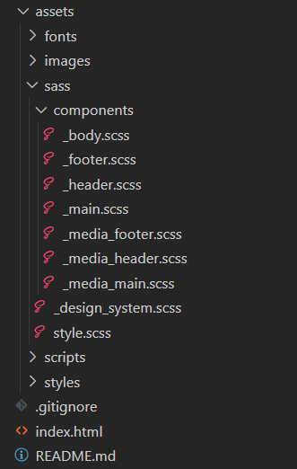
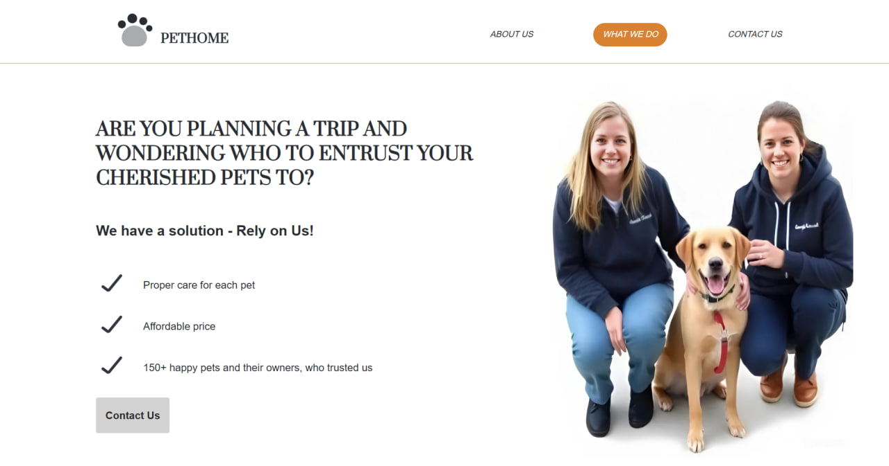
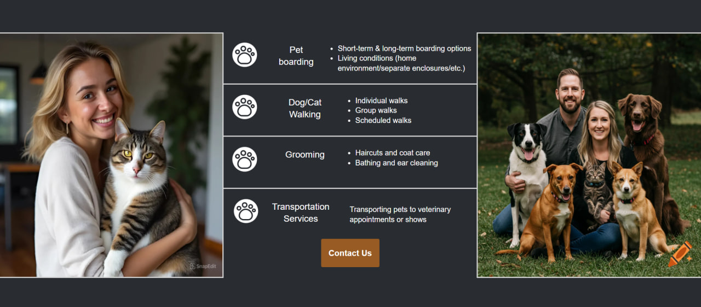
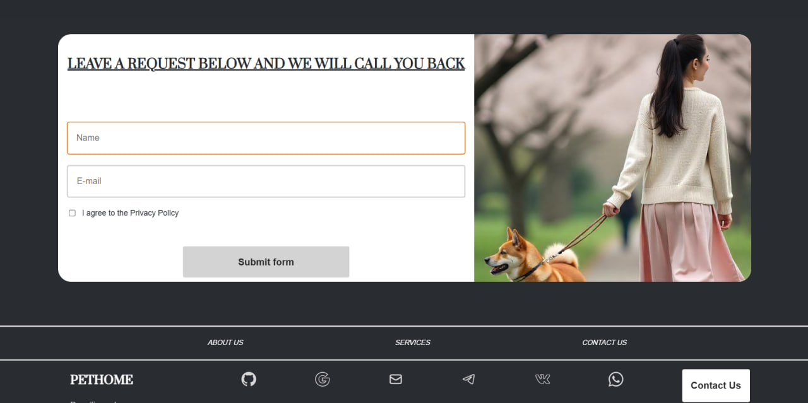
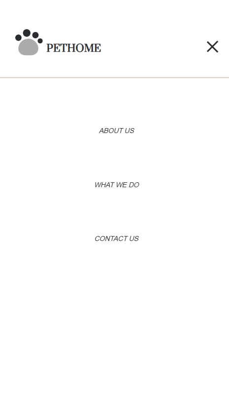

# This is a test project, which aims to create a website using a design from the Figma graphic design tool.

One of the conditions of the assignment was to completely change the graphic design of the layout: replace text, images and colors at your discretion, using imagination and artificial intelligence capabilities.
 

## The final project is the PetHome website.
"PetHome" - is a company providing pet care services, including dog/cat walking, bathing, various types of haircuts and grooming, visits to the veterinarian, and care for pets while owners are away  and much more. 
 

## Project structure:
### The website is a one-page landing, which contains 3 information blocks about the company: "About us", "What we Do" and "Contacts".

The project is based on the Figma graphic editor.
The project stack is based on html5, css3, and js.

The project architecture is built using the Sass preprocessor (see the develop branch):

The website is compatible with different browsers (it opens correctly in Google Chrome, Microsoft Edge, Opera, and Safari).
The website is adapted to work on various devices (desktop, tablet, mobile):

#### Desktop version:

 

#### Burger-menu In the mobile version:

### The code contains all the necessary comments to easily understand the structure of the project

### The project was created without using any libraries or frameworks

